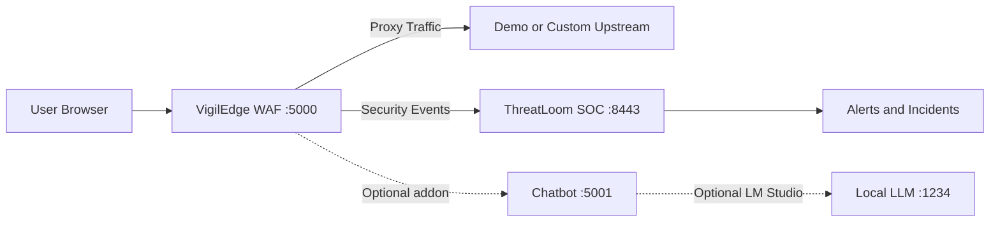

# VigilEdge + ThreatLoom

Local-first security stack that combines inline WAF blocking with SOC correlation and incident workflows.

Unlike typical single-layer demos, this project gives you both traffic protection and SOC intelligence in one run.

One command launches the full environment on Windows.

## Start Here (No Technical Setup Needed)

### Easiest path

Double-click:

```bat
run_oneclick.bat
```

### Command-line path

```powershell
powershell -NoProfile -ExecutionPolicy Bypass -File .\deploy_oneclick.ps1
```

If you are new to terminal usage, use the double-click option first.

## Why This Is Different

1. Full one-click deployment with admin elevation, firewall rules, venv setup, and startup orchestration.
2. Hybrid defense model: WAF filtering plus SOC-side ingestion, detection, and incident view.
3. Flexible operating modes: full demo for learning, custom upstream for real app protection.
4. Offline-capable installation fallback from local wheel/package directories.

## Core Security Capability Snapshot

- Signature-driven detection (SQLi, XSS, command-injection style, path traversal)
- Rate-abuse and burst-control handling
- SOC event ingestion and alert pipeline
- Correlation and behavioral analysis in ThreatLoom detection engine

## Offline Installation (Highlighted)

The installer first tries standard pip. If network/package source fails, it automatically retries from local package directories.

Use explicit offline source:

```powershell
powershell -NoProfile -ExecutionPolicy Bypass -File .\deploy_oneclick.ps1 -LocalPackageDir .\offline_packages
```

Auto-detected directories:

- `offline_packages`
- `offline-packages`
- `packages`
- `wheels`

## Quick Success Check

### Beginner check

If these pages open, deployment is working:

- http://localhost:5000 (WAF)
- http://localhost:8443 (SOC)
- http://localhost:8080 (demo app, full mode)

### Technical check

```powershell
Get-NetTCPConnection -State Listen -ErrorAction SilentlyContinue |
  Where-Object { $_.LocalPort -in 5000,5001,8080,8443 } |
  Select-Object LocalAddress,LocalPort,OwningProcess |
  Sort-Object LocalPort
```

## Deployment Modes

Use full demo for first run. Use custom mode when protecting your own website.

| Mode | Command | What starts | Best for |
|---|---|---|---|
| Full demo (default) | `deploy_oneclick.ps1` | WAF + SOC + demo app + chatbot | First-time setup and validation |
| Custom upstream | `deploy_oneclick.ps1 -Mode custom` | WAF + SOC + chatbot + your upstream | Real local/staging website protection |
| Skip chatbot | `deploy_oneclick.ps1 -SkipChatbot` | WAF + SOC + target stack | Pure security pipeline |

If `-UpstreamUrl` is provided in custom mode, URL prompt is skipped.

## Architecture



If Mermaid does not render on your platform, use this fallback:

```text
Browser -> WAF (:5000) -> Upstream App
              |
              +-> ThreatLoom SOC (:8443) -> Alerts/Incidents
              \-> (optional) Chatbot (:5001) -> (optional) LM Studio (:1234)
```

## What One-Click Does (Short Version)

- elevates to Administrator
- checks ports and paths
- creates firewall rules (Private profile)
- creates missing WAF and ThreatLoom virtual environments
- installs dependencies (online, then offline fallback if needed)
- creates missing `.env` files and fills placeholder secrets
- runs ThreatLoom migration when production mode is enabled
- starts services and prints ready URLs

## Runtime URLs

- WAF: http://localhost:5000
- WAF login: http://localhost:5000/login
- WAF dashboard: http://localhost:5000/admin/dashboard
- WAF protected route: http://localhost:5000/protected
- SOC dashboard: http://localhost:8443
- Demo app: http://localhost:8080
- Chatbot health: http://localhost:5001/health

## Chatbot Role

The chatbot is an optional operator-assistance addon.

- It helps explain threat context and events.
- It is not required for WAF or SOC core operation.
- If LM Studio is offline, core security features continue to work.

## Prerequisites

- Windows 10/11
- Python 3.10+ in PATH (3.13 recommended)
- free ports: `5000`, `5001`, `8080`, `8443`
- Administrator rights for firewall configuration

Python download:

- https://www.python.org/downloads/

Optional:

- LM Studio at `http://localhost:1234`

## First-Run Failure Guide

### Problem: "It opens admin prompt and closes"

This is expected. The script relaunches itself with elevated rights.

### Problem: "Page is not opening"

Check port usage:

```powershell
Get-NetTCPConnection -State Listen | Where-Object { $_.LocalPort -in 5000,5001,8080,8443 }
```

### Problem: "Dependency install failed"

Run with local package fallback:

```powershell
powershell -NoProfile -ExecutionPolicy Bypass -File .\deploy_oneclick.ps1 -LocalPackageDir .\offline_packages
```

### Problem: "Chatbot has no AI response"

Ensure LM Studio is running with a loaded model at `http://localhost:1234`.

> [!WARNING]
> The bundled demo application is intentionally vulnerable.
> Do not expose it to the public internet.
> Use demo mode only in controlled local/lab environments.

## Legacy Launchers

These remain unchanged and available:

- `start_demo.bat`
- `start_custom_website.bat`
- `start_chatbot.bat`

## Project Status

- Active development stream with production-oriented direction
- One-click deployment stabilized for local onboarding
- Formal semantic release tagging planned

## Roadmap (Priority Order)

1. Release tags + changelog
2. Offline wheel-bundle generator
3. Containerized deployment profile
4. Expanded startup/auth integration tests
5. UI screenshots and guided visual walkthroughs

## Contributing

Contributions are welcome for detection improvements, deployment hardening, docs, and testing.

Open an issue with:

- problem statement
- reproduction steps
- expected behavior
- proposed fix

## Deployment Details

For complete local and production instructions, see [DEPLOYMENT.md](DEPLOYMENT.md).

## License

This workspace includes MIT-licensed components. See `LICENSE` and nested project licenses.
