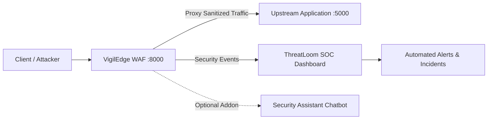

# VigilEdge WAF & ThreatLoom SOC

  

VigilEdge is an enterprise-grade, local-first Web Application Firewall (WAF) seamlessly integrated with the ThreatLoom Security Operations Center (SOC). Engineered for zero-trust environments, VigilEdge provides robust, real-time traffic inspection and threat mitigation, while ThreatLoom delivers deep visibility, behavioral analytics, and incident response workflows.

Unlike standard reverse-proxies, VigilEdge provides comprehensive, multi-layered defense out of the box.

---

## 🛡️ Core Security Capabilities

- **Deep Packet Inspection & Signature Detection**: Advanced Regex-based heuristics optimized to detect and block SQL Injection (SQLi), Cross-Site Scripting (XSS), Command Injection, and Path Traversal with near-zero false positive rates.
- **AI-Assisted Threat Scoring**: Machine learning engine that scores anomalous traffic and predicts attack patterns before they manifest into known CVEs.
- **Rate-Abuse & Burst Control**: Intelligent rate-limiting algorithms to mitigate volumetric DDoS attempts and brute-force attacks.
- **ThreatLoom SOC Correlation**: Real-time event ingestion, IP reputation tracking, and automated security incident generation.
- **Windows Event Viewer Integration**: Native OS-level logging for seamless integration with external SIEM tools.

---

## 🏗️ System Architecture



---

## 📸 System Gallery

### VigilEdge WAF Dashboard


### ThreatLoom SOC Interface


### Real-Time Monitoring & Event Logs


### Attack Interception


---

## 🚀 Deployment Guide

VigilEdge supports multiple deployment profiles. We highly recommend using Docker for isolated, reproducible deployments.

### Option A: Docker Deployment (Recommended)

The entire ecosystem is fully containerized. A single command will spin up the VigilEdge WAF and a vulnerable target application for penetration testing.

**Prerequisites:** Docker and Docker Compose installed.

```bash
# Clone the repository
git clone https://github.com/Myabyss000/VigilEdge.git
cd VigilEdge

# Build and start the infrastructure
docker-compose up --build -d
```

### Option B: Local PowerShell Installation

For native Windows Server deployments, use the automated setup script. This script automatically provisions virtual environments, downloads dependencies, and configures Windows Firewall rules.

**Prerequisites:** Python 3.10+ and Administrator privileges.

```powershell
# Run from an Administrator PowerShell prompt
powershell -NoProfile -ExecutionPolicy Bypass -File .\deploy_oneclick.ps1
```

*To protect a custom upstream application instead of the bundled test environment:*
```powershell
powershell -NoProfile -ExecutionPolicy Bypass -File .\deploy_oneclick.ps1 -Mode custom
```

### Option C: Air-Gapped / Offline Installation

If you are deploying to an isolated environment without internet access, VigilEdge can install dependencies directly from local wheel directories.

```powershell
powershell -NoProfile -ExecutionPolicy Bypass -File .\deploy_oneclick.ps1 -LocalPackageDir .\offline_packages
```

---

## 📊 Dashboard Access

Once deployed, the ecosystem will be available at the following endpoints:

| Interface | URL | Default Port | Description |
|---|---|---|---|
| **WAF Dashboard** | `http://localhost:8000/admin/dashboard` | `8000` | Real-time traffic metrics and firewall administration |
| **SOC Interface** | `http://localhost:8443` | `8443` | ThreatLoom security operations and incident tracking |
| **Protected App** | `http://localhost:5000` | `5000` | The upstream application currently protected by VigilEdge |

> **⚠️ Security Warning:** The bundled demonstration application (`vulnerable-app`) contains intentional vulnerabilities for penetration testing and validation. **Never expose the vulnerable application directly to the public internet without VigilEdge actively proxying its traffic.**

---

## 🤖 AI Security Assistant

VigilEdge includes an optional LLM-powered chatbot designed to assist Security Analysts with threat context and incident remediation.
* Ensure LM Studio or a compatible local model is running at `http://localhost:1234` before enabling AI insights.
* The WAF and SOC will continue to function normally if the AI is offline.

---

## 🤝 Contributing

We welcome contributions from the cybersecurity community! Whether it is refining threat signatures, enhancing the machine learning models, or hardening the deployment pipeline, your PRs are appreciated.

Please refer to `DEPLOYMENT.md` for advanced developer documentation and testing instructions.

## 📄 License

VigilEdge is open-source software. See the `LICENSE` file for full terms and conditions.
