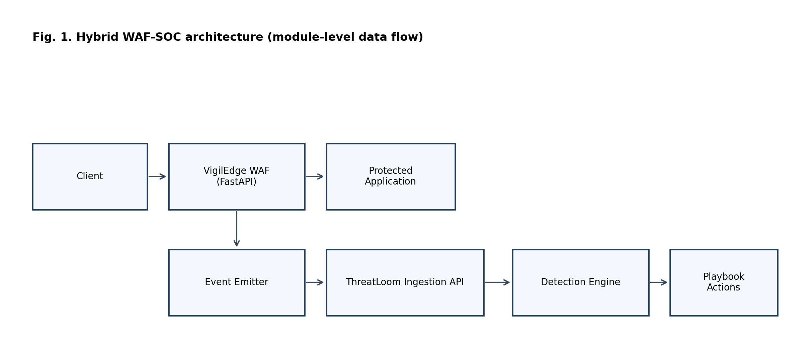
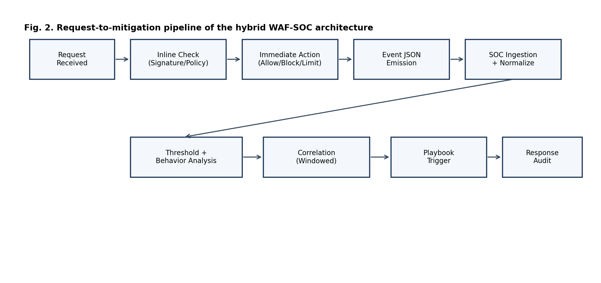
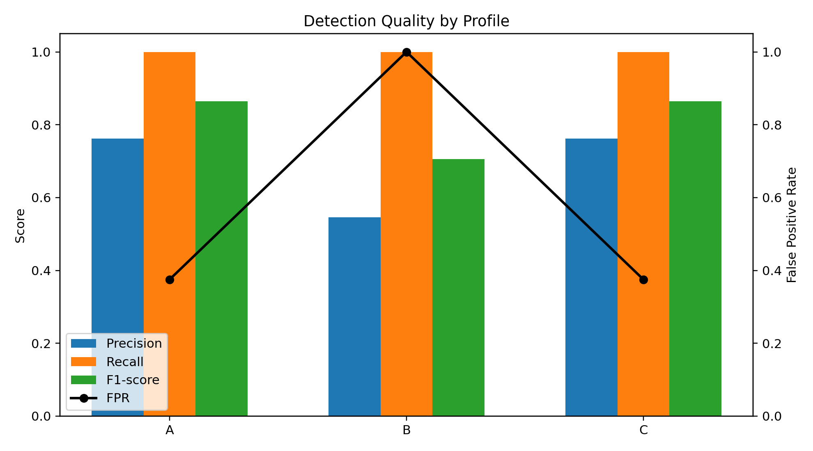
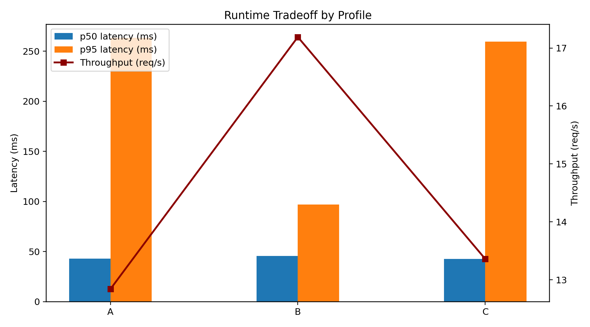
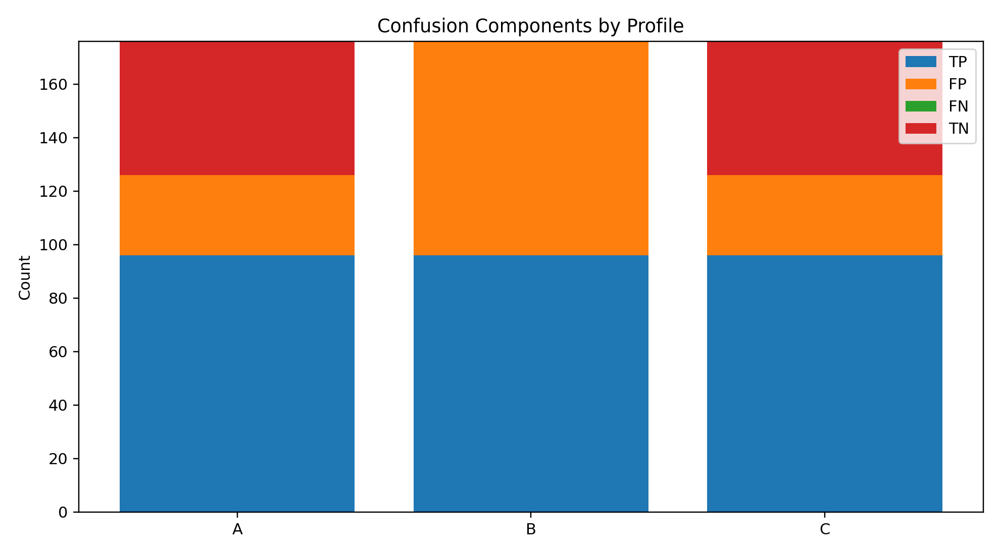

# VigilEdge-ThreatLoom: A Local Hybrid WAF-SOC Architecture for Real-Time Web Threat Detection and Automated Response

## IEEE Author Block (Double-Blind Submission)
Author details are intentionally omitted for double-blind review.

## Abstract
This paper presents VigilEdge-ThreatLoom, a hybrid WAF-SOC architecture for local web defense where managed cloud-edge controls may be impractical because of cost, policy, or connectivity constraints. The implemented system links inline Web Application Firewall (WAF) enforcement with downstream Security Operations Center (SOC) analytics and playbook-driven response, with accessibility as a core goal for single-service local deployments. We evaluate three primary profiles: signature-only WAF (A), WAF plus SOC rule analytics (B), and full hybrid WAF-SOC architecture with response orchestration (C), with an additional exploratory B-tuned rerun. Reported metrics include precision, recall, F1-score, false positive rate (FPR), p50/p95 latency, and throughput. Mitigation delay is not reported in this run because end-to-end response timestamp capture for B and C is incomplete. Results show identical recall across profiles (1.0000) but high false-positive instability (FPR means approximately 0.66 with wide CI95), indicating calibration risk. Profiles A and C provide the best quality balance in this workload, with C adding operational visibility and response lifecycle capability. The contribution is an evidence-bounded local architecture and reproducible evaluation workflow.

## Index Terms
Web application firewall, SOC automation, hybrid detection, incident response, local cybersecurity.

## I. INTRODUCTION
Web applications continue to represent a dominant external attack surface. Common adversarial traffic includes SQL injection, cross-site scripting, path traversal, command injection, and request-flood abuse. While cloud edge platforms provide robust protective controls, many organizations still require local deployment due to data governance boundaries, air-gapped operation, budget constraints, or educational-lab conditions.

In local deployments, rule-based WAF filtering is widely used but frequently isolated from downstream operational context. As a result, campaign-level behavior and cross-event progression may remain underdetected, and mitigation decisions may remain manual or delayed. This paper evaluates whether a hybrid WAF-SOC architecture can improve practical local defense outcomes while maintaining acceptable runtime overhead.

### A. Problem Statement
Signature-only local WAF deployments exhibit three practical limitations:
1. Per-request analysis with limited temporal context.
2. Weak visibility of distributed and low-and-slow attack behavior.
3. Fragmented detection-to-response execution paths.

### B. Research Question
Can a local hybrid WAF-SOC architecture improve detection and response effectiveness compared to signature-only local filtering, while preserving acceptable latency and throughput under local test conditions?

### C. Contributions
This paper makes six contributions:
1. A local, modular architecture coupling inline WAF enforcement with SOC analytics and automated response.
2. A staged hybrid detection model integrating signature, threshold, behavioral, and time-window correlation logic.
3. A reproducible experimental protocol for quality and performance benchmarking.
4. An implemented one-command local deployment workflow (with offline fallback) to improve operational accessibility and reproducibility.
5. A deployment-evidence subsection that quantifies operational completion outcomes for the evaluated run session.
6. An explicit evidence-boundary analysis that documents validity risks, operational limitations, and safe-claim boundaries.

### D. Innovation Statement
The core innovation is not a new single detector, but an accessibility-first and deployment-first security architecture that unifies prevention and operations in a local environment. Specifically, the system combines low-cost deployment, offline-capable execution, reproducible evaluation artifacts, and analyst-governed automation in one integrated stack. This positions the work as a practical bridge between basic local firewalls and high-cost cloud-managed security ecosystems.

Standout contribution summary: this work combines inline enforcement, SOC correlation, and auditable response in one reproducible local stack, which is uncommon in low-cost single-service deployments.

Example use case: a small business owner running one public-facing web service on a low-cost VPS can deploy this architecture locally to gain both request-time filtering and SOC-style incident visibility without subscribing to enterprise cloud-edge tooling.

## II. RELATED WORK
Conventional WAF literature focuses on rule-based payload inspection and low-latency mediation, exemplified by early system overviews and attack-focused detection work [@modsecurity_overview; @sqli_detection; @xss_detection]. SOC/SIEM practice emphasizes event centralization, correlation, and incident handling workflows [@nist80061]. Threat-class taxonomies and defensive verification guidance are covered by OWASP and MITRE [@owasp_top10_2021; @mitre_attack; @owasp_asvs].

In practice, tools such as ModSecurity represent mature rule-centric WAF deployment models, while cloud WAF platforms emphasize managed policy updates, global telemetry, and multi-region edge enforcement [@modsecurity_project; @cloudflare_waf; @aws_waf].

Most prior references treat these concerns in separate layers. This work positions itself against that separation: the contribution is a deployable hybrid WAF-SOC architecture that integrates inline filtering, structured event transport, correlation, and bounded response into one local reproducible stack. The target is not cloud-scale parity; the target is accessible security operations depth for constrained deployments.

Compared to standalone WAF-only tools, this design adds SOC-side temporal/correlation reasoning and response governance. Compared to SOC-only log analysis systems, this design adds inline enforcement context at event origin time. Compared to managed cloud WAFs, it trades global intelligence scale for local deployability, control, and reproducibility.

## III. ARCHITECTURE OVERVIEW
The system is organized into four layers.

### A. Inline Enforcement Layer (VigilEdge)
The WAF inspects HTTP traffic and applies attack-class checks including SQLi, XSS, traversal, and command-injection style payloads. It enforces allow, block, or rate-limit actions and emits structured event records.

### B. Ingestion and Normalization Layer (ThreatLoom)
ThreatLoom ingests event streams through API endpoints and normalizes key fields, including source IP, path, action, attack type, severity, and timestamps.

### C. Detection and Correlation Layer
The SOC engine executes signature and threshold rules, runs behavioral analyzers, and performs IP/session/time-window correlation to identify repeated and escalating activity.

### D. Response Orchestration Layer
Playbook triggers map alert conditions to actions such as block, temporary ban, and adaptive rate limit. Action state is tracked, auditable, and revocable.

In implementation terms, a playbook is a rule-to-action mapping: if trigger condition(s) match (for example threshold + anomaly), execute predefined action script(s) with cooldown and revocation constraints.

### E. Accessibility and Deployment-by-Design
The architecture is intentionally designed for environments where cloud-edge security is unavailable or operationally unsuitable. This includes academic labs, resource-constrained teams, private intranet services, and policy-restricted deployments. The system is designed for security-aware operators to run on commodity hardware with transparent controls and reproducible script-driven experiments.

The current implementation includes an autonomous one-command launcher (`deploy_oneclick.ps1`) with a double-click wrapper (`run_oneclick.bat`) for Windows-first local deployment. The launcher automates environment preparation and service orchestration, including privilege elevation and offline-capable dependency setup. This operational layer is treated as an accessibility and reproducibility contribution rather than as a detection-performance claim.

Accessibility in this paper means operational accessibility (cost, ownership, and deployability under local constraints), not zero-configuration usability for non-technical users.

### F. Architecture Diagram
Fig. 1. Hybrid WAF-SOC architecture and module-level flow.

## IV. DETECTION AND RESPONSE PIPELINE
The pipeline proceeds in stages:
- Inline signature and policy enforcement.
- Event enrichment and normalized persistence.
- Rule and threshold analytics in SOC processing cycles.
- Behavioral and temporal correlation.
- Playbook-based mitigation with override support.

This staged strategy aims to preserve low-latency inline filtering while increasing post-ingestion context depth for higher-confidence operations decisions.

### Pipeline Diagram
Fig. 2. Request-to-mitigation pipeline of the hybrid WAF-SOC architecture.

### A. Detailed System Flow (Request to Mitigation)
- A request enters the WAF and is normalized (path, query, headers, payload fingerprints).
- Signature and policy checks produce an immediate decision: allow, block, or rate-limit.
- A structured event is emitted with source, action, severity, threat class, and timestamp.
- ThreatLoom ingests and normalizes the event into SOC-ready fields.
- Rule engines evaluate threshold conditions across time windows.
- Behavioral correlators evaluate repeated probing, burst anomalies, and escalation patterns.
- If trigger conditions are met, a playbook action is selected and executed.
- Response outcomes are recorded with audit metadata and optional revocation support.

### B. Module Data Flow and Event Structure
Events are transferred from WAF to SOC as JSON records over REST endpoints. A minimal event schema includes: `event_id`, `timestamp`, `source_ip`, `request_path`, `http_method`, `action` (allow/block/rate_limit), `threat_type`, `severity`, `rule_id`, and `context_tags`.

This explicit event contract enables downstream correlation and response without re-parsing raw HTTP traffic in the SOC layer.

### C. Internal Working Logic
The internal operation uses two linked decision loops:
- Inline decision loop (fast path): input is request features and signature matches; output is immediate enforcement action with minimal latency impact.
- SOC decision loop (context path): input is the event stream over temporal windows; output is contextual alerting and bounded response actions.

A simplified scoring model is:
$$
R_t = w_S S_t + w_T T_t + w_B B_t + w_C C_t
$$

subject to
$$
w_S + w_T + w_B + w_C = 1, \quad w_S,w_T,w_B,w_C \ge 0
$$

where:

| Symbol | Meaning in this study |
|---|---|
| $R_t$ | Combined risk score at time window $t$ |
| $S_t$ | Signature confidence term at time window $t$ |
| $T_t$ | Threshold/rate-pressure term at time window $t$ |
| $B_t$ | Behavioral-anomaly term at time window $t$ |
| $C_t$ | Multi-event correlation term at time window $t$ |
| $w_S, w_T, w_B, w_C$ | Non-negative weights for $S_t, T_t, B_t, C_t$ |
| $\tau$ | Risk threshold that triggers playbook evaluation |

In simplified operation, each component is normalized to $[0,1]$ and combined by weighted summation. If $R_t \geq \tau$, the system evaluates response policy constraints and executes the selected action.

Numerical example (illustrative): let $S_t=0.80$, $T_t=0.60$, $B_t=0.40$, $C_t=0.70$, and weights $(w_S,w_T,w_B,w_C)=(0.35,0.25,0.20,0.20)$. Then:
$$
R_t = 0.35\cdot0.80 + 0.25\cdot0.60 + 0.20\cdot0.40 + 0.20\cdot0.70 = 0.65
$$
If $\tau=0.60$, response playbook evaluation is triggered.

Practical mapping note: in this implementation, $S_t$ is derived from matched signature severity, $T_t$ from threshold counters within configured windows, $B_t$ from temporal behavior shifts, and $C_t$ from multi-event consistency across source/time context.

This two-loop design is the practical mechanism by which the system avoids relying only on per-request signatures while still preserving fast inline protection.

## V. IMPLEMENTATION DETAILS
The implementation is Python-based and service-oriented. The WAF and SOC services expose HTTP/REST interfaces and exchange structured JSON events. The stack uses FastAPI/Uvicorn services, background async tasks, YAML/JSON configuration files for rules/playbooks, and relational persistence for SOC entities.

### A. Execution Model
The implementation follows a split execution model:
1. Synchronous path for inline request mediation (WAF).
2. Asynchronous path for SOC analytics and response orchestration.

This split limits user-visible latency while enabling richer post-ingestion reasoning. It is also a key engineering tradeoff in local deployments where compute resources are finite.

Concurrency/load handling:
- Async request handling is used in both services.
- ThreatLoom runs periodic background detection cycles (configurable scan interval and lookback window).
- Database backends support SQLite for development and PostgreSQL-compatible async drivers for production-style deployments.

### B. Operational Safety Controls
- Role-based access for sensitive APIs.
- Response cooldown and revocation pathways.
- Alert deduplication windows to reduce analyst fatigue.
- Structured logs and event metadata for traceability.

Security summary: SOC APIs use authenticated access with role-based restrictions for privileged actions, and ingestion endpoints support service-to-service credentials.

### C. Enforcement Logic (Rate Limiting and Blocking)
Rate limiting and blocking are driven by per-source counters and threshold windows. At a simplified level, repeated suspicious requests within a configured window increment risk and can escalate actions from allow to rate-limit to block.

Blocking state is maintained with timestamped entries so temporary actions can expire or be revoked. This avoids permanent lockout by default and supports analyst override.

Practical policy example used in this codebase context: default API rate limits are minute-window based, and profile-level thresholds tune when repeated events transition into stronger enforcement.

Concrete thresholds are configuration-dependent and profile-specific; this paper evaluates their aggregate behavior through profile-level outcomes rather than prescribing universal numeric defaults.

Tuning strategy: start with conservative thresholds, measure FPR impact on benign traffic, then adjust per attack family while preserving recall.

Current thresholds were selected from rule-of-thumb security baselines and iterative local validation runs, not from formal statistical optimization.

### D. Behavioral Analysis Example
Example: if a source submits benign-seeming requests at low volume and then rapidly shifts to repeated traversal patterns within a short interval, the behavioral module raises anomaly pressure even when each individual request alone appears borderline. This enables earlier detection of campaign-style progression.

Additional scenarios:
- Progressive authentication abuse: repeated login failures below hard threshold become high-confidence when combined with endpoint concentration and burst timing.
- Multi-vector probing: mixed XSS and traversal attempts from one source in a short window increase correlation pressure even when individual signatures are moderate.

### E. Logging and Storage
The architecture uses structured security events (JSON payloads) for inter-module communication and persists SOC-side entities (alerts, incidents, response actions) in backend storage. Logs include timestamp, source, action, and threat metadata to support audit and replay.

Storage and retrieval implementation details are intentionally summarized here; full API and configuration specifics are retained in project documentation rather than repeated in the manuscript body.

### F. Deployment Pathways and Scope
Current scope supports single-application deployment on a single node.

Two setup pathways are implemented:

| Pathway | Operator actions | Automation level | Research relevance |
|---|---|---|---|
| Legacy manual path | Execute setup and launch commands in sequence | Low | Baseline reproducibility pathway |
| One-command launcher path (Windows-first) | Run `deploy_oneclick.ps1` (or `run_oneclick.bat`) and select mode when prompted | High | Accessibility and repeatability contribution |

Operational scope note: this deployment pathway improves onboarding and reproducibility under local constraints. It is not a direct detector-quality improvement mechanism.

## VI. EXPERIMENTAL METHODOLOGY
This section specifies the protocol used to generate and rerun the reported measurements.

### A. Compared Profiles
1. Profile A: signature-only local WAF.
2. Profile B: WAF plus SOC rules/thresholds.
3. Profile C: full hybrid WAF-SOC with response playbooks.

### B. Traffic Workloads
- Benign control traffic.
- SQLi variants (plain, obfuscated, encoded).
- XSS variants (tag, attribute, encoded).
- Traversal and file-inclusion attempts.
- Command-injection style attempts.
- Brute-force and burst/flood phases.

### C. Evaluation Metrics
- Reported in this manuscript: precision, recall, F1-score, false positive rate (FPR), p50 latency, p95 latency, and throughput (requests per second).
- Planned but not reliably captured in this session: detection delay and mitigation delay.

### D. Reproducibility Conditions
- Pinned environment and dependency versions.
- Frozen configuration snapshots per profile.
- Multi-run statistics (mean and standard deviation).
- Raw artifact retention for audit and rerun.
- Scripted startup path recorded (manual and one-command launcher variants).

### E. Protocol Revision Note (356 vs 126 Requests)
Two benchmark protocols exist in the artifact history. Earlier exploratory runs used 356 requests per profile (single-pass style). The final reproducible session used in this manuscript (`run_20260322_020932`) uses 126 requests per trial with 3 repeated trials per profile. This revision was adopted to improve run stability, avoid process-overlap contamination, and support repeated-trial statistics. All final tables in this manuscript are derived only from the 126-request repeated-trial session.

### F. Evaluation Scope and Unmeasured Dimensions
The current paper reports repeated synthetic benchmark runs (3 trials per profile) with aggregated mean, standard deviation, and CI95 half-width for core quality/runtime metrics. A supplemental quick operational probe was also executed for partial resource/query evidence. The following remain out of full evidence scope in this session: direct mitigation-delay timing, populated server-side timing headers, adversarial evasion/bypass resilience, and controlled scale/stress resource-query benchmarking.

### G. Evidence-Boundary Checklist (Reviewer-Facing)
To prevent over-claiming, the evaluation status of key dimensions is declared explicitly:

| Dimension | Status in this manuscript | Implication |
|---|---|---|
| Sample size/statistical power | Limited (n=3 trials per profile) | CI95 is reported, but statistical confidence remains weak |
| Mitigation delay | Not measured | Response evaluation is incomplete |
| Data realism | Synthetic-only workload | External validity to production traffic is limited |
| Real-world traffic replay | Not performed | No operational traffic validation claim |
| Adversarial bypass/evasion testing | Not performed | Robustness against adaptive attackers is unverified |
| CPU/RAM profiling | Preliminary (host-level short-window probe) | Service-level efficiency and long-window behavior remain unverified |
| Stress/scalability benchmarking | Not measured | No saturation or capacity claim |
| Formal threshold optimization | Not performed | Current tuning is heuristic/exploratory |
| Behavioral module ablation | Not performed | Independent effect size is not quantified |
| Log/query performance benchmarking | Preliminary (SQLite micro-benchmark only) | API-level and scale/stress retrieval performance remain unverified |
| Latency-detection quantitative model | Not fitted | No Pareto or response-surface claim |
| False-negative challenge validation | Not performed | Zero FN in synthetic labels is not generalized |

## VII. RESULTS
### A. Detection Quality (Mean +/- Std)
| Profile | Precision | Recall | F1-score | False Positive Rate |
|---|---:|---:|---:|---:|
| A | 0.6998 +/- 0.2600 | 1.0000 +/- 0.0000 | 0.8062 +/- 0.1678 | 0.6556 +/- 0.5680 |
| B | 0.6998 +/- 0.2600 | 1.0000 +/- 0.0000 | 0.8062 +/- 0.1678 | 0.6556 +/- 0.5680 |
| C | 0.6970 +/- 0.2624 | 1.0000 +/- 0.0000 | 0.8039 +/- 0.1698 | 0.6667 +/- 0.5774 |
| B-tuned | 0.6998 +/- 0.2600 | 1.0000 +/- 0.0000 | 0.8062 +/- 0.1678 | 0.6556 +/- 0.5680 |

### B. Detection Quality (CI95 Half-Width)
| Profile | Precision CI95 +/- | Recall CI95 +/- | F1 CI95 +/- | FPR CI95 +/- |
|---|---:|---:|---:|---:|
| A | 0.2943 | 0.0000 | 0.1899 | 0.6427 |
| B | 0.2943 | 0.0000 | 0.1899 | 0.6427 |
| C | 0.2969 | 0.0000 | 0.1921 | 0.6533 |
| B-tuned | 0.2943 | 0.0000 | 0.1899 | 0.6427 |

### C. Runtime Performance (Mean +/- Std)
| Profile | p50 Latency (ms) | p95 Latency (ms) | Throughput (req/s) | Mitigation Delay (ms) |
|---|---:|---:|---:|---:|
| A | 28.72 +/- 6.14 | 121.56 +/- 150.30 | 17.91 +/- 8.22 | Not measured |
| B | 32.23 +/- 6.52 | 125.35 +/- 117.17 | 16.01 +/- 6.52 | Not measured |
| C | 28.85 +/- 4.56 | 117.19 +/- 135.47 | 17.56 +/- 7.67 | Not measured |
| B-tuned | 28.15 +/- 4.45 | 146.06 +/- 177.36 | 16.74 +/- 8.02 | Not measured |

### D. Runtime Performance (CI95 Half-Width)
| Profile | p50 CI95 +/- | p95 CI95 +/- | Throughput CI95 +/- |
|---|---:|---:|---:|
| A | 6.9461 | 170.0859 | 9.2989 |
| B | 7.3823 | 132.5908 | 7.3817 |
| C | 5.1598 | 153.2956 | 8.6766 |
| B-tuned | 5.0336 | 200.7011 | 9.0748 |

Mitigation delay note: mitigation delay is not reported for B and C because this benchmark run did not capture synchronized alert-to-action completion timestamps.

Repeated-run note: values above are means across 3 trials per profile (session `run_20260322_020932`). Full variance and CI95 are available in per-profile `aggregate_stats.json` artifacts.

### E. Figure Assets (Generated)
Fig. 3. Detection quality comparison by profile.
Fig. 4. Latency and throughput tradeoff.
Fig. 5. Confusion components by profile.

Figure interpretation notes:
- Fig. 3 highlights quality divergence, especially profile B false-positive behavior.
- Fig. 4 shows runtime tradeoff between tail latency, throughput, and quality.
- Fig. 5 makes class-wise confusion behavior explicit (including false negatives).

Measured benchmark note:
- Profiles A, B, C, and B-tuned were each computed from live local benchmark runs with 126 requests per trial and 3 trials per profile.
- Raw request-level artifacts and summaries are stored under `research_package/results/run_20260322_020932/`.
- Consolidated paper-ready table is provided in `research_package/results/run_20260322_020932/RESULTS_TABLE_FOR_PAPER.md`.
- False-positive behavior remains unstable across trials (high FPR variance and wide CI95), requiring calibration before production claims.

### F. Additional Conductable Tests (Quick Operational Probe)
To address reviewer concerns about "conductable now" gaps, an additional compact operational probe session (`run_20260322_quick_ops`) was executed with short-run traffic and database-level measurements.

Quick hybrid probe (single trial, 64 requests):
- Precision: 1.0000
- Recall: 1.0000
- FPR: 0.0000
- p50 latency: 39.26 ms
- p95 latency: 282.64 ms
- Throughput: 6.30 req/s
- Alerts created in run window: 5
- Alert pipeline delay proxy (log receipt to alert creation): mean 5220.02 ms, p95 7778.23 ms

Host resource probe during benchmark execution (9 samples):
- CPU utilization: mean 18.70%, p95 28.72%
- Memory utilization: mean 85.08%, p95 85.34%

SQLite log/query micro-benchmark (50 runs/query):
- Recent 200 logs query: mean 17.235 ms, p95 22.186 ms
- SQLi high-severity recent query: mean 5.603 ms, p95 7.965 ms
- Source-IP time-window count query: mean 14.158 ms, p95 20.033 ms
- Attack-type aggregation query: mean 0.252 ms, p95 0.281 ms

Response orchestration proxy from historical alert-incident links:
- Non-negative alert-to-incident creation lag pairs: n=33, mean 3659.40 ms, p95 5354.34 ms
- Historical negative lag pairs were also observed (n=223), indicating legacy linkage/timestamp inconsistency that requires cleanup before claiming strict end-to-end mitigation delay.

Operational note: these additions are supplemental and do not replace the main repeated-trial A/B/C/B-tuned comparison. They reduce evidence gaps for resource and query behavior, while direct mitigation completion timing remains unresolved.

### G. Discussion of Measured Outcomes
Three observations are most relevant for publication claims. First, recall was 1.0000 across all profiles in this synthetic workload, indicating consistent interception of attack-labeled requests. Second, median runtime remained low (tens of milliseconds) across profiles, but p95 variance was large across trials. Third, false-positive behavior remained highly unstable (FPR means around 0.65-0.67 with large CI95), indicating a calibration problem rather than a clear architectural ranking signal in this session.

The runtime data should be interpreted with the same caution. Although Profile B reported higher throughput and lower p95 latency, those gains are coupled to indiscriminate blocking and therefore are not operationally acceptable. Consequently, the primary contribution is not that every layered configuration improves outcomes, but that measurable cross-layer observability exposes when policy settings become unsafe and enables systematic correction.

Profile quality instability is attributable to threshold and rule calibration under this synthetic workload and should be treated as a system-tuning lesson rather than evidence against the hybrid WAF-SOC architecture.

Profile C is preferable to Profile A despite similar aggregate metrics because C provides richer operational visibility (correlated alerts/incidents), explicit response lifecycle records, and governed automation pathways that A does not provide.

There is an explicit trade-off between latency and detection depth: adding SOC-side context analysis can increase processing complexity, but it can also improve operational decision quality and reduce hidden campaign progression risk when calibrated properly.

This trade-off remains unresolved in the current session: although latency medians are acceptable, confidence-bounded differentiation between profiles is weak because FPR variance dominates comparative quality interpretation. No formal latency-detection response-surface or Pareto curve is claimed in this version.

Behavioral analysis was integrated into scoring logic but not independently benchmarked with isolated module-level metrics (for example separate ablation precision/recall contribution), so its standalone contribution magnitude is not claimed.

False positives directly affect usability by interrupting legitimate user traffic and increasing analyst burden. Therefore, controlling FPR is critical for real-world deployment viability, not merely a reporting metric.

False negatives in this run are reported as zero across profiles based on the labeled synthetic workload; this does not guarantee zero false negatives in real traffic.

Potential false-negative scenarios include heavily obfuscated payloads, low-and-slow multi-session campaigns, and attacks that remain below active threshold windows while avoiding high-confidence signatures.

### H. Deployment Workflow Evaluation (Pilot)
Deployment was evaluated as an operational property of the study workflow rather than as a detection metric. The one-command launcher was used as the primary startup pathway for repeated benchmark execution in this version.

Observed deployment evidence in session `run_20260322_020932` is summarized below.

| Deployment indicator | Observed value | Interpretation |
|---|---:|---|
| Planned profile-trial runs completed | 12/12 (100%) | End-to-end execution completed for all scheduled profile-trial jobs |
| Launcher-induced aborts after environment preparation | 0 | No observed orchestration failure in this run session |
| Operator command count for startup path | 1 (one-command path) vs multi-step manual path | Reduced operator interaction complexity |

Startup time, first-attempt success rate across fresh machines, and setup-error rates were not instrumented formally in this version. Therefore, deployment usability is partially quantified (completion outcomes) but not yet evaluated with full human-factor metrics.

### I. Utility and Differentiation
Practical utility is established along three axes. First, security utility: the system sustains perfect recall in this workload while exposing false-positive behavior explicitly. Second, operational utility: the architecture links detection to auditable and revocable response actions, reducing manual SOC burden. Third, deployment utility: the stack can be executed locally with transparent controls, which is critical for institutions that cannot depend on managed cloud-edge services.

Differentiation is also explicit. Compared to a signature-only local WAF, this design adds temporal and behavioral reasoning plus response orchestration. Compared to cloud-edge platforms, this design prioritizes accessibility, local control, and reproducibility over global telemetry scale. The contribution is therefore best understood as a deployable, evidence-bounded middle layer between basic local filtering and enterprise cloud-edge ecosystems.

### J. Completed Work in This Study
The final research package is implementation-backed and measurement-backed. Completed work includes:
- Architecture design and integration of a local WAF-SOC stack.
- Reproducible benchmark script development.
- Execution of profile-based evaluations (A/B/C and B-tuned exploratory rerun).
- Artifact generation in CSV/JSON formats.
- Automated figure generation from measured outputs.
- Implementation and study use of the one-command local deployment pathway (Windows-first) with offline package fallback.
- Manuscript and reproducibility-document synchronization across submission artifacts.

The benchmark outcomes establish an evidence-bounded narrative under local synthetic conditions: runtime overhead is manageable, attack recall is saturated, and calibration stability (especially false positives) is the dominant unresolved deployment risk.

## VIII. THREATS TO VALIDITY
1. Internal validity: residual configuration drift between runs and limited trial count (n=3 per profile) reduce statistical power.
2. External validity: synthetic workload bias versus production traffic and no real-world traffic replay validation.
3. Construct validity: label quality for borderline payloads and no dedicated false-negative stress campaign.
4. Systems validity: machine-level performance variation; preliminary host-level CPU/memory probe was executed, but no controlled service-level or long-window resource benchmark was completed.
5. Method validity: no formal threshold optimization sweep and no quantitative latency-detection trade-off model.

## IX. LIMITATIONS
- Evaluation data remains small and synthetic (126 requests per trial, 3 trials per profile), so statistical and external validity are limited.
- One-command deployment is currently Windows-first; this constrains portability and limits generalization of deployment-usability claims beyond the tested operating context.
- Cross-platform one-command validation (Linux/macOS) has not yet been completed.
- Rule quality and maintenance cadence remain critical.
- Local threat intelligence breadth is inherently limited versus global edge systems.
- Aggressive automation can increase false-positive impact.
- Single-node deployments may constrain high-load behavior.
- Current implementation supports single-application deployment in one-node mode.
- Distributed scaling and multi-node coordination are not yet implemented.
- Machine-learning-based adaptive detection is not included in the current version.
- Repeated-trial variance and CI95 are reported, but sample size (n=3 per profile) remains statistically limited.
- Resource profiling is preliminary (host-level short-window probe only); controlled per-service CPU/memory profiling and horizontal scaling analysis are not yet included.
- Security hardening of the defensive stack itself (for example service isolation and anti-bypass resilience testing) is incomplete and should be expanded before production use.
- No adversarial bypass/evasion test campaign is reported in this version.
- A B-tuned exploratory rerun is reported, but no formal threshold optimization sweep is yet implemented.
- False-negative behavior is only observed on synthetic labels and is not externally validated.
- Logging/query behavior has preliminary SQLite micro-benchmark data, but API-level and scale/stress query benchmarking remain incomplete.
- Behavioral analysis is integrated but not independently evaluated with module-specific metrics.
- No quantitative latency-versus-detection model is fitted in this version.

## X. ETHICAL AND RESPONSIBLE USE CONSIDERATIONS
All testing and evaluation must be executed on authorized assets and controlled targets. The system and methodology are intended for defensive cybersecurity research and operations only.

## XI. CONCLUSION
This study demonstrates that a local hybrid WAF-SOC stack is implementation-feasible, reproducibly runnable, and operationally inspectable under repeated synthetic trials. The architecture consistently achieved complete attack-label recall in the tested workload while maintaining low median runtime overhead, establishing clear baseline viability for constrained local deployments. The critical unresolved risk is calibration stability: false positives remain highly variable across profiles and trials, including exploratory tuned settings.

Core claim: the strongest validated contribution is an implementation-backed local WAF-SOC architecture and repeatable benchmarking workflow that converts calibration risk from an implicit operational hazard into an explicit, measurable, and auditable engineering target.

Boundary claim: this manuscript does not claim production-grade response completeness, adversarial robustness, or scalability sufficiency until mitigation-delay instrumentation, real-traffic validation, stress/resource benchmarking, and formal optimization studies are completed.

## XII. PRACTICAL APPLICATIONS
Immediate uses are academic submission, preprint sharing of architecture and methodology, and baseline documentation for calibrated reruns.

## XIII. FUTURE WORK
- Cross-platform extension and quantitative usability evaluation of the implemented one-command deployment workflow (startup time, first-attempt success rate, and operator effort).
- Distributed multi-node deployment and centralized coordination.
- End-to-end mitigation delay instrumentation and reporting.
- Optional adaptive scoring augmentation with machine learning.

## ACKNOWLEDGMENT
The author declares that this work was conducted independently without external supervision or institutional research support. All design, implementation, and evaluation were carried out by the author.

## REFERENCES
References are managed in `research_package/references.bib` and should be rendered in IEEE numeric style in final exports.
